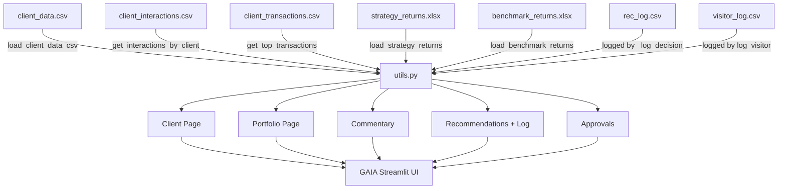
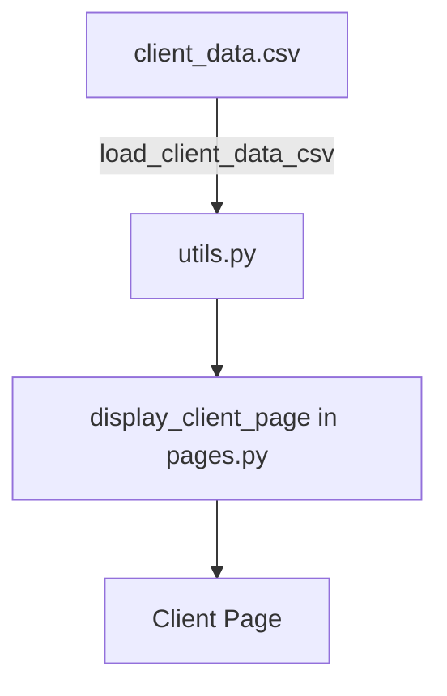
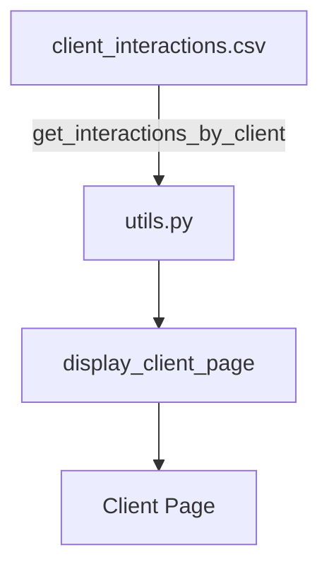
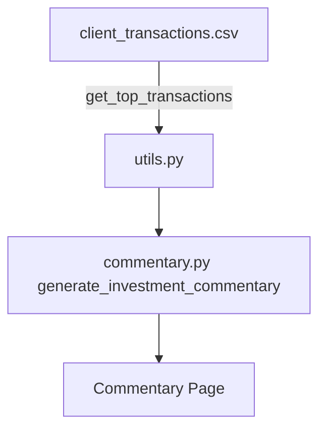
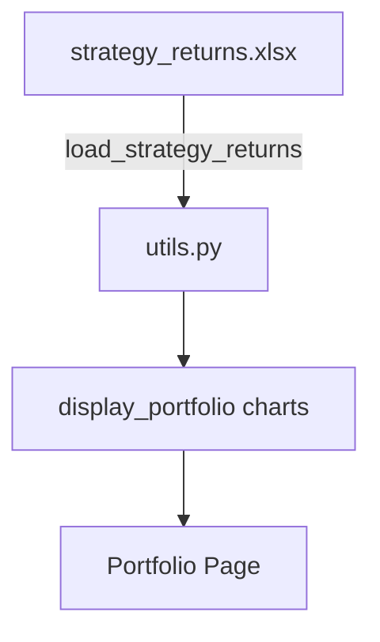
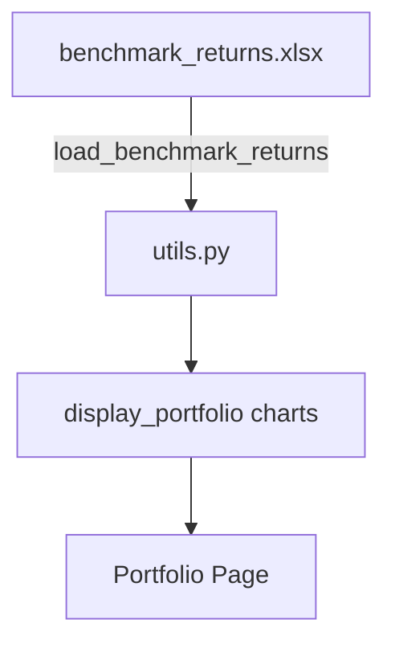
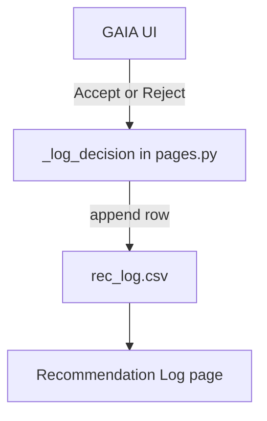
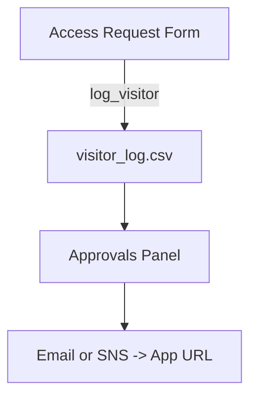

# 📈 GAIA: Generative AI Investment Analytics

https://gaia-fin-studio-umumr.ondigitalocean.app/

> **Free your data. Own your insights. Customize your edge.**

**GAIA** is built to **showcase the power of open‑source LLMs and a Python-native analytics stack** as a practical alternative to expensive, inflexible vendor platforms such as **Bloomberg**, **FactSet**, **PitchBook**, **Morningstar Direct**, **Capital IQ**, and **YCharts**.  

With those tools you’re often stuck with:

- 🚫 Rigid rollout timelines and slow access to new AI features  
- 🔒 Vendor lock‑in and black‑box logic you can’t audit  
- 🧱 Limited customization and integration pain  
- 💸 High per-seat/API costs that scale poorly

**GAIA flips that model** — using open LLMs, Python-native analytics, and low-cost cloud:
- 🧠 Open models (e.g., Groq-hosted Llama 3, Mixtral, Gemma) for commentary and research
- 💻 You own the Streamlit app and data
- ☁️ **Deploys on DigitalOcean for ~$5/month** (see “Deploy” below) — avoid massive platform fees

---

## 🚩 What GAIA Delivers
- Personalized client dashboards
- AI-generated investment commentary
- Strategy vs. benchmark performance visualization
- Recommendation tracking and audit logs
- Access approvals and basic security guardrails

---

## 🧭 Table of Contents
- [Project Structure](#-project-structure)
- [Architecture (Mermaid)](#-architecture-mermaid)
- [Data Asset Catalog](#-data-asset-catalog)
  - [client_data.csv](#1-client_datacsv)
  - [client_interactions.csv](#2-client_interactionscsv)
  - [client_transactions.csv](#3-client_transactionscsv)
  - [strategy_returns.xlsx](#4-strategy_returnsxlsx)
  - [benchmark_returns.xlsx](#5-benchmark_returnsxlsx)
  - [rec_log.csv](#6-rec_logcsv)
  - [visitor_log.csv](#7-visitor_logcsv)
- [Usage](#-usage)
- [Deploy (incl. DigitalOcean $5/mo)](#-deploy-incl-digitalocean-5mo)
- [Security](#-security)
- [Best Practices](#-best-practices)
- [License](#-license)

---

## 📂 Project Structure
```plaintext
📁 your-repo/
 ├── app.py               ← Main Streamlit app entry
 ├── pages.py             ← Page routing, dashboards, recs, approvals
 ├── commentary.py        ← Groq client + investment commentary generation
 ├── utils.py             ← Data loaders, plotting, logging helpers
 ├── assets/
 │    ├── Collector.py    ← yfinance wrappers
 │    ├── Portfolio.py    ← simple portfolio object
 │    └── Stock.py        ← stock object + actions
 ├── data/                ← CSV/XLSX inputs + logs (see catalog below)
 ├── .streamlit/          ← config + secrets.toml (do not commit secrets)
 ├── docs/                ← (optional) MkDocs site for deeper docs
 ├── requirements.txt     ← Python deps
 ├── Dockerfile           ← container build
```

---

## 🧠 Architecture

> ✅ Fixes: each edge is on its own line, and edge labels avoid parentheses/slashes to keep GitHub Mermaid happy.

---

## 📚 Data Asset Catalog

> A combined **data dictionary + flow** for every core dataset that GAIA uses.

### 1) `client_data.csv`
**Purpose:** Client demographics shown on Client page.
| Column         | Description                 | Example        |
|----------------|-----------------------------|----------------|
| `client_name`  | Unique client name          | "Acme Family"  |
| `aum`          | Assets under management     | 1000000        |
| `age`          | Client age                  | 55             |
| `risk_profile` | Risk tolerance label        | "Moderate"     |



---

### 2) `client_interactions.csv`
**Purpose:** CRM-style interaction history per client.
| Column              | Description                 | Example              |
|---------------------|-----------------------------|----------------------|
| `client_name`       | Must match client_data.csv  | "Acme Family"        |
| `date`              | Interaction date            | "2025-06-15"         |
| `interaction_type`  | Call/Meeting/Email/etc.     | "Quarterly Review"   |
| `notes`             | Summary/next steps          | "Discussed rebalance"|



---

### 3) `client_transactions.csv`
**Purpose:** Recent buys/sells used in commentary & tables.
| Column              | Description                            | Example        |
|---------------------|----------------------------------------|----------------|
| `Name`              | Security name                          | "Apple Inc."   |
| `Transaction Type`  | Buy or Sell                            | "Buy"          |
| `Direction`         | Position change                        | "Increase"     |
| `Total Value ($)`   | Trade notional                         | 25000          |
| `Selected_Strategy` | Strategy label to filter by            | "Equity"       |
| `Commentary`        | Analyst note/context                   | "Q2 positioning"|



---

### 4) `strategy_returns.xlsx`
**Purpose:** Strategy performance time series.
| Column       | Description              | Example      |
|--------------|--------------------------|--------------|
| `as_of_date` | Month-end or daily date  | "2025-06-30" |
| `<strategy>` | Return series per column | 0.012        |



---

### 5) `benchmark_returns.xlsx`
**Purpose:** Benchmark performance time series to compare vs strategy.
| Column       | Description              | Example      |
|--------------|--------------------------|--------------|
| `as_of_date` | Month-end or daily date  | "2025-06-30" |
| `<benchmark>`| Benchmark return series  | 0.009        |



---

### 6) `rec_log.csv`
**Purpose:** Audit log of user decisions on recommendations.
| Column        | Description                         | Example            |
|---------------|-------------------------------------|--------------------|
| `timestamp`   | ISO datetime                        | 2025-08-10T13:20   |
| `client`      | Client name                         | "Acme Family"      |
| `strategy`    | Strategy name                       | "Equity"           |
| `category`    | Derived from recommendation card id | "idea"             |
| `card_id`     | Unique card id                      | "idea_3"           |
| `title`       | Card title                          | "Trim 10% into..." |
| `decision`    | Accept or Reject                    | "Accept"           |
| `ml_score`    | Model score                         | 0.87               |



---

### 7) `visitor_log.csv`
**Purpose:** Access-request + approval trail.
| Column      | Description              | Example                 |
|-------------|--------------------------|-------------------------|
| `timestamp` | ISO datetime             | 2025-08-10T09:12        |
| `name`      | Visitor display name     | "Jane Doe"              |
| `email`     | Visitor email            | "jane@example.com"      |



---

## ⚙️ Usage

### Prereqs
- Python **3.9+**, `pip`
- Optional: Docker

### Install & Run
```bash
pip install -r requirements.txt
streamlit run app.py
```

### Environment
Set via shell or `.streamlit/secrets.toml`:
```bash
export GROQ_API_KEY=your_key
export GAIA_GATE_ON=true
export GAIA_APP_URL=http://localhost:8501
```

### Tests
```bash
pytest
```

### Docker
```bash
docker build -t gaia-dashboard .
docker run -p 8501:8501 gaia-dashboard
```

---

## 🚀 Deploy (incl. DigitalOcean $5/mo)

### Option A — DigitalOcean Droplet (~$5/mo)
1. Create a **Basic Droplet** (1 vCPU, 512MB–1GB RAM) — about **$5/month**.  
2. SSH in and install deps:
   ```bash
   sudo apt update && sudo apt install -y python3-pip python3-venv nginx
   git clone https://github.com/YOUR_USERNAME/YOUR_REPO.git && cd YOUR_REPO
   python3 -m venv .venv && source .venv/bin/activate
   pip install -r requirements.txt
   ```
3. **Systemd service** (Streamlit on `0.0.0.0:8501`):
   ```ini
   # /etc/systemd/system/gaia.service
   [Unit]
   Description=GAIA Streamlit
   After=network.target

   [Service]
   User=root
   WorkingDirectory=/root/YOUR_REPO
   ExecStart=/root/YOUR_REPO/.venv/bin/streamlit run app.py --server.port 8501 --server.address 0.0.0.0
   Environment=GROQ_API_KEY=your_key
   Environment=GAIA_GATE_ON=true
   Restart=always

   [Install]
   WantedBy=multi-user.target
   ```
   ```bash
   sudo systemctl daemon-reload
   sudo systemctl enable --now gaia
   ```
4. **Nginx reverse proxy** (optional) on `:80`/`:443` and TLS via `certbot`.

### Option B — DigitalOcean App Platform (Starter ~$5/mo)
- Connect your GitHub repo, choose **Python** service.
- Build: `pip install -r requirements.txt`  
- Run: `streamlit run app.py --server.port $PORT --server.address 0.0.0.0`  
- Add env vars (`GROQ_API_KEY`, `GAIA_GATE_ON`, etc.).  
- App Platform handles HTTPS, scaling, and deploys on push.

> 💡 These options keep infra spend **around $5/month**, demonstrating the value of **owning your stack** without legacy vendor fees.

---

## 🔐 Security
- Secrets via env vars or `.streamlit/secrets.toml` (never commit)
- Access approvals logged in `visitor_log.csv`
- Recommendation decisions logged in `rec_log.csv`
- Rotate keys and back up `data/` on a schedule

---

## ✅ Best Practices
- Version and document all data schemas
- Update diagrams when adding datasets/pages
- Keep `.env`/`secrets.toml` out of Git (`.gitignore`)
- Consider nightly backups of `data/` in production

---

## 📜 License
MIT — see `LICENSE`.

---

**Built by Scott Morgan — with ❤️ for open models, transparent insights, and real‑time customization.**
